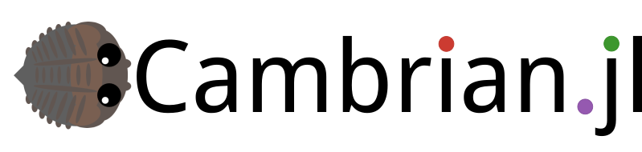

# Cambrian.jl

[](https://travis-ci.org/d9w/Cambrian.jl) [](https://coveralls.io/r/d9w/Cambrian.jl?branch=master) [](https://codecov.io/gh/d9w/Cambrian.jl)



A functional Evolutionary Computation framework.

## Installation

Cambrian can be installed through the Julia package manager:

```julia
julia> ]
pkg> add Cambrian
pkg> test Cambrian
```

## Usage

Cambrian is intended as a common framework for evolutionary computation
algorithms in Julia. Algorithm implementations should define a subclass of the
`AbstractEvolution` type which must have the following fields:
```julia
config::NamedTuple
logger::CambrianLogger
population::Array{<:Individual}
```

Each subclass must also implement
```julia
populate(e::<:AbstractEvolution)
evaluate(e::<:AbstractEvolution)
generation(e::<:AbstractEvolution)
```

An example Genetic Algorithm and the `1+λ` algorithm are provided in `src/GA.jl`
and `src/oneplus.jl`, with usage examples in `test/ga.jl` and `test/oneplus.jl`.

Algorithms can also define new `Individual` types or use the provided
`FloatIndividual` and `BoolIndividual`. New `Individual` types should have the fields:
```julia
genes::<:AbstractArray
fitness::Array{Float64}
```

and implement the following methods:
```julia
mutate(i::<:Individual)
crossover(parents::Vararg{Individual})
```
or make use of the provided methods.

In Cambrian, individual `fitness` is always a vector of dimension `d_fitness`,
defined in the provided configuration file. For the case of single-objective
fitness, this adds slight overhead but is intended to make all methods flexible
to multi-objective optimization.

Individual algorithms are encouraged to be separated as new packages which
follow the Cambrian framework. Common functionality between multiple algorithms
should be integrated into Cambrian as needed.

## Ecosystem

Cambrian is used in the following packages:
+ [BERL.jl](https://github.com/d9w/BERL.jl)
+ [CartesianGeneticProgramming.jl](https://github.com/d9w/CartesianGeneticProgramming.jl)
+ [MTCGP.jl](https://github.com/d9w/MTCGP.jl)
+ [AGRN.jl](https://github.com/d9w/AGRN.jl)

There are other evolutionary computation packages in Julia:
+ [Evolutionary.jl](https://github.com/wildart/Evolutionary.jl)
+ [NSGA-II.jl](https://github.com/gsoleilhac/NSGAII.jl/)

Some of the code in Cambrian is from or used in my course on [evolutionary
computation](https://github.com/d9w/evolution).

## Development

Cambrian is still under heavy development, so expect breaking changes. Pull
requests are greatly appreciated.

A non-exhaustive list of possible upcoming features:
+ better documentation using [Documenter](https://github.com/JuliaDocs/Documenter.jl)
+ --Abstract evolution type for multiple dispatch--
+ Parallelization and test
+ CMA-ES
+ NSGA-II
+ Novelty archive
+ co-evolution
+ genetic speciation
+ Island-based
